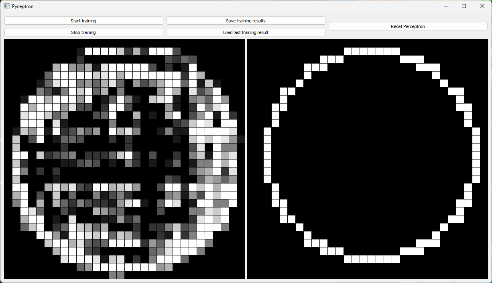

# Pyceptron
## Python Perceptron implementation

Pyceptron is a simple neural network trained to distinct rectangles from circles. 

## About Perceptron 
[Perceptron](https://en.wikipedia.org/wiki/Perceptron) (known also as **McCulloch-Pitts neuron**) is the simplest form of a neural network. It consists of a single single neuron which makes prediction based on a linear predcition function combining set of weights with input. 

## Usage 
Run `python main run` to enter sandbox mode and play with pyceptron. Run `python main train` to enter training mode.

## Dependencies 
Python libraries: 
- PyQt5
- Numpy
- typer